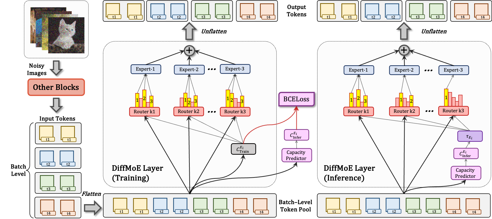

# DiffMoE: Dynamic Token Selection for Scalable Diffusion Transformers <br><sub>Official PyTorch Implementation</sub>

<!-- [](https://arxiv.org/abs/2406.11838)&nbsp; -->
<!-- [](https://paperswithcode.com/sota/image-generation-on-imagenet-256x256?p=autoregressive-image-generation-without) -->
<!-- [](http://colab.research.google.com/github/LTH14/mar/blob/main/demo/run_mar.ipynb) -->
<!-- [](https://huggingface.co/jadechoghari/mar)&nbsp; -->


<div align="center">
<div align="center" style="margin-top: 0px; margin-bottom: 0px;">
<!--  -->
</div>

### [<a href="https://arxiv.org/abs/xxx" target="_blank">arXiv</a>] [<a href="https://shiml20.github.io/DiffMoE/" target="_blank">Project Page</a>] [<a href="https://huggingface.co/datasets/KwaiVGI/DiffMoE/" target="_blank">Model</a>]

_**[Minglei Shi<sup>1*</sup>](https://github.com/shiml20/), [Ziyang Yuan<sup>1*</sup>](https://scholar.google.ru/citations?user=fWxWEzsAAAAJ&hl=en), [Haotian Yang<sup>2</sup>](https://scholar.google.ru/citations?user=fWxWEzsAAAAJ&hl=en), [Xintao Wang<sup>2†</sup>](https://xinntao.github.io/),  [Mingwu Zheng<sup>2</sup>](https://scholar.google.com.hk/citations?user=MdizB60AAAAJ&hl=en), [Xin Tao<sup>2</sup>](https://www.xtao.website/), [Wenliang Zhao<sup>1</sup>](https://wl-zhao.github.io/), [Wenzhao Zheng<sup>1</sup>](https://wzzheng.net/), [Jie Zhou<sup>1</sup>](https://www.imem.tsinghua.edu.cn/info/1330/2128.htm),[Jiwen Lu<sup>1†</sup>](https://www.au.tsinghua.edu.cn/info/1078/3156.htm), [Pengfei Wan<sup>2</sup>](https://scholar.google.com/citations?user=P6MraaYAAAAJ&hl=en), [Di Zhang<sup>2</sup>](https://openreview.net/profile?id=~Di_ZHANG3), [Kun Gai<sup>2</sup>](https://scholar.google.com/citations?user=PXO4ygEAAAAJ&hl=zh-CN)**_
<br>
(*equal contribution, †corresponding author.)

<sup>1</sup>Tsinghua University, <sup>2</sup>Kuaishou Technology.

</div>

<p align="center">
  
</p>


## 🔥 Updates
- __[2025.x.x]__: Release the [project page](https://shiml20.github.io/DiffMoE/) of DiffMoE

<!-- This is a PyTorch/GPU implementation of the paper [DiffMoE](xxxx) -->


## 📖 Introduction

**TL;DR:** DiffMoE is a dynamic MoE Transformer that outperforms 1.5× larger dense models in diffusion tasks, using global token pool and adaptive routing while keeping 1× parameter activation.  <br>


This repo contains:

<!-- * 🪐 A simple PyTorch implementation of [MAR](models/mar.py) and [DiffLoss](models/diffloss.py) -->
<!-- * ⚡️ Pre-trained class-conditional MAR models trained on ImageNet 256x256 -->
<!-- * 💥 A self-contained [Colab notebook](http://colab.research.google.com/github/LTH14/mar/blob/main/demo/run_mar.ipynb) for running various pre-trained MAR models -->
<!-- * 🛸 An MAR+DiffLoss [training and evaluation script](main_mar.py) using PyTorch DDP -->
<!-- * 🎉 Also checkout our [Hugging Face model cards](https://huggingface.co/jadechoghari/mar) and [Gradio demo](https://huggingface.co/spaces/jadechoghari/mar) (thanks [@jadechoghari](https://github.com/jadechoghari)). -->


### To-do list

- [x] training / inference scripts
- [ ] huggingface ckpts

## Preparation

### Dataset
Download [ImageNet](http://image-net.org/download) dataset, and place it in your `IMAGENET_PATH`.

### Installation

Download the code:
```
git clone https://github.com/KwaiVGI/DiffMoE.git 
cd DiffMoE
```


A suitable [conda](https://conda.io/) environment named `diffmoe` can be created and activated with:

```
conda env create -f environment.yaml
conda activate diffmoe
```

<!-- Download pre-trained VAE and DiffMoE models: -->

<!-- ``` -->
<!-- python util/download.py -->
<!-- ``` -->

For convenience, our pre-trained MAR models can be downloaded directly here as well:

| MAR Model                                                              | FID-50K | Inception Score | # Average Actice Params | 
|------------------------------------------------------------------------|---------|-----------------|---------|
| [DiffMoE-L-E16-DDPM](https://www.dropbox.com/scl/fi/f6dpuyjb7fudzxcyhvrhk/checkpoint-last.pth?rlkey=a6i4bo71vhfo4anp33n9ukujb&dl=0) | ???    | ???           | ???    |
| [DiffMoE-L-E16-Flow](https://www.dropbox.com/scl/fi/pxacc5b2mrt3ifw4cah6k/checkpoint-last.pth?rlkey=m48ovo6g7ivcbosrbdaz0ehqt&dl=0) | ???    | ???           | ???    |


### (Optional) Caching VAE Latents

Given that our data augmentation consists of simple center cropping and random flipping, 
the VAE latents can be pre-computed and saved to `CACHED_PATH` to save computations during DiffMoE training:

```
torchrun --nproc_per_node=8 --nnodes=1 --node_rank=0 \
main_cache.py \
--img_size 256 --vae_path pretrained_models/vae/kl16.ckpt --vae_embed_dim 16 \
--batch_size 128 \
--data_path ${IMAGENET_PATH} --cached_path ${CACHED_PATH}
```

## Usage

### Demo
<!-- Run our interactive visualization [demo](http://colab.research.google.com/github/LTH14/mar/blob/main/demo/run_mar.ipynb) using Colab notebook! -->
Comeing soon, stay tuned !

### Local Gradio App

Comeing soon, stay tuned !

<!-- ```
python demo/gradio_app.py 
``` -->


### Training
Script for the default setting (MAR-L, DiffLoss MLP with 3 blocks and a width of 1024 channels, 400 epochs):
```
torchrun --nproc_per_node=8 --nnodes=1 --node_rank=0 \
train.py \
--config ../config/000_DiffMoE_S_E16_Flow.yaml

```
<!-- 
- Training time is ~1d7h on 32 H100 GPUs with `--batch_size 64`.
- Add `--online_eval` to evaluate FID during training (every 40 epochs).
- (Optional) To train with cached VAE latents, add `--use_cached --cached_path ${CACHED_PATH}` to the arguments. 
Training time with cached latents is ~1d11h on 16 H100 GPUs with `--batch_size 128` (nearly 2x faster than without caching).
- (Optional) To save GPU memory during training by using gradient checkpointing (thanks to @Jiawei-Yang), add `--grad_checkpointing` to the arguments. 
Note that this may slightly reduce training speed. -->

### Evaluation (ImageNet 256x256)
Comeing soon, stay tuned !

<!-- Evaluate MAR-B (DiffLoss MLP with 6 blocks and a width of 1024 channels, 800 epochs) with classifier-free guidance:
```
torchrun --nproc_per_node=8 --nnodes=1 --node_rank=0 \
main_mar.py \
--model mar_base --diffloss_d 6 --diffloss_w 1024 \
--eval_bsz 256 --num_images 50000 \
--num_iter 256 --num_sampling_steps 100 --cfg 2.9 --cfg_schedule linear --temperature 1.0 \
--output_dir pretrained_models/mar/mar_base \
--resume pretrained_models/mar/mar_base \
--data_path ${IMAGENET_PATH} --evaluate
``` -->

<!-- 
- Set `--cfg 1.0 --temperature 0.95` to evaluate without classifier-free guidance.
- Generation speed can be significantly increased by reducing the number of autoregressive iterations (e.g., `--num_iter 64`). -->

## Acknowledgements
We thank Zihan, Qiu for helpful discussion. A large portion of codes in this repo is based on [MAR](https://github.com/LTH14/mar), [DiT](https://github.com/facebookresearch/DiT), [DeepSeekMoE](https://github.com/deepseek-ai/DeepSeek-MoE)

<!-- ## Contact -->


## 🌟 Citation

```
@article{shi2025diffmoe,
  title={DiffMoE: Dynamic Token Selection for Scalable Diffusion Transformers},
  author={Shi, Minglei and Yuan, Ziyang and Yang, Haotian and Wang, Xintao and Zheng, Mingwu and Tao,  Xin and Zhao, Wenliang and Zheng, Wenzhao and Zhou, Jie and Lu, Jiwen and Wan, Pengfei and ZHANG, Di and Gai, Kun },
  journal={arXiv preprint arXiv:xxxx},
  year={2025}
}
```